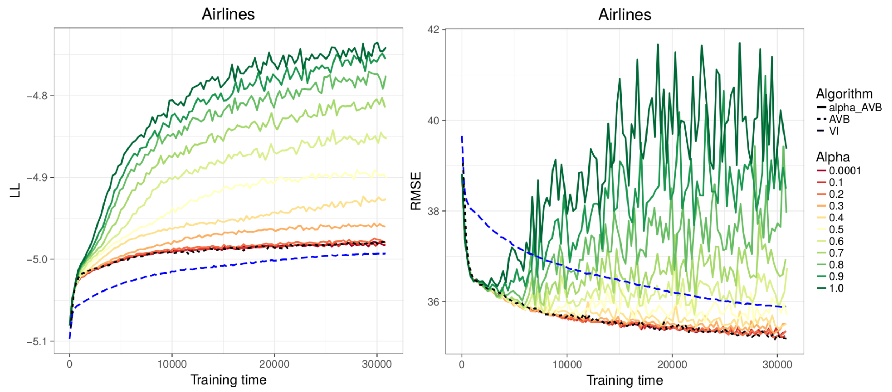

# Code for Adversarial Alpha-Divergence Minimization

This repository contains the code for the method of Adversarial Alpha-Divergence Minimization (AADM) algorithm. Some very simple examples are given for the use of the code: a toy problem, one application to the Boston Housing UCI dataset and a final example with a large dataset (Airlines Delay).

## Dependencies

To run the codes we have used Python 3.6. Moreover, the following dependencies must be installed
* [Tensorflow 1.13.1](https://www.tensorflow.org/)
* [Numpy 1.14.3](https://numpy.org/)
 
## Experiments

Here are included some examples of the experiments performed with AADM, including code and the datasets employed. Whenever one of the codes included is executed, it creates a folder and stores the results automatically, which in each case might be different depending on the task we are interested in. 

### Synthetic problems

Two synthetic dataset were generated: one where the data follows a bimodal posterior distribution and another where the posterior is heteroscedastic. Both the datasets and the code employed can be found in the folder `toy_problems`. The final results, when comparing _alpha = 1.0_ to _alpha = 0.0001_ behave as the following:

### UCI example - Boston Housing

As an example for the rest of the datasets employed, the folder `UCI_example` includes the code and files necessary to try the AADM algorithm in the Boston Housing dataset (included in the folder as well). The file named `permutations_boston_housing.txt` contains 20 rows of the randomly shuffled index of the rows of the dataset so every method can train using the exact same permutations as the others. To extract the results we executed all the codes in all of these 20 permutations and averaged the performance of each method across them. There are three codes included:

* `AADM_boston.py`  -  Our proposed method. To run it use `python3.6 AADM_boston.py <split number> <alpha value> <layers of the main network - 1 or 2> boston_housing.txt`.
* `AVB_boston.py`  -  The Adversarial Variational Bayes code we have reproduced to compare results. This code can be run with the same line of AADM substituting the name of the python script. 
* `VI_boston.py`  -  Variational Inference to use as a baseline to compare results as well. To run this code use `python3.6 VI_boston.py <split_number> <layers of the main network - 1 or 2> boston_housing.txt`.

For each dataset we obtained a new set of 20 permutations and averaged the performance, obtaining the results presented in the paper. In order to use this codes for other similar datasets we would only have to change the name of the file employed in the previous calls for the algorithms and create a permutations file accordingly. 

### Big dataset example - Airlines Delay

Finally we include the code for one of the experiments we performed in a big dataset to study the convergence. The folder `big_data_example` contains the code and the data to perform the Airlines Delay study we present in the paper. The file `shuffled_airlines.npy` should contain the binarized and randomly shuffled dataset of Airlines Delay we have employed for our experiments. The data needs to be downloaded from [here](https://www.kaggle.com/usdot/flight-delays/downloads/airports.csv/1) and converted to the variables we have described in the paper. Once this is done and the results are stored in `.npy` format we can perform the experiments. The three codes included are:

* `AADM_airlines.py`  -  Our method. To run it use `python3.6 AADM_airlines.py <alpha value> <number of layers of the main network - 1 or 2>`.
* `AVB_airlines.py`  -  Adversarial Variational Vayes. To run it, use the previous line excluding the flag of the value of _alpha_.
* `VI_airlines.py`  -  Variational Inference.  To run it do the same as in the case of AVB. 

## Further information

For more examples of the code, the datasets employed for any of the experiments and other results or further questions, please contact at [simon.rodriguez@icmat.es](mailto:simon.rodriguez@icmat.es) or open an issue. 
